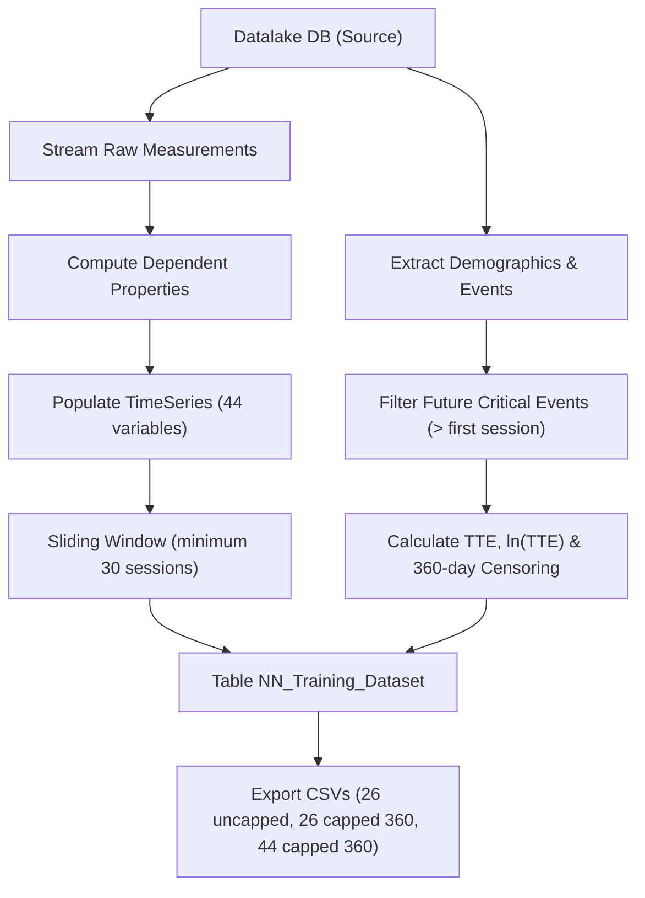

# SIATE Datalake - Patient CSV Generator & Neural Network Datasets

Module for processing, transforming, and exporting hemodialysis patient data from the PostgreSQL clinical datalake for neural network training and validation (Time-To-Event prediction).

---

## Overview

The generator (`patient_csv_generator.py`) runs an end-to-end pipeline that:
1. Connects to the source database `datalake` and extracts patient demographics, dialysis sessions, and clinical events (starting from 2023).
2. Creates and populates a dedicated target database `datalake_export` containing:
   - `Patient`: demographics, gender, ethnicity, date of birth, date of death, and the date of the first critical event subsequent to the start of dialysis.
   - `Measurements`: raw clinical measurements recorded during sessions.
   - `DependentProperties`: derived clinical properties computed via specialized scripts.
   - `TimeVar`: metadata and statistics per variable (bounds, mean, standard deviation).
   - `TimeSeries`: indexed time series organized by patient, timestamp, and variable.
   - `NN_Training_Dataset`: structured dataset for training neural network models.
3. Exports final CSV files into the `NN_Dataset/` directory.

---

## Processing Pipeline



---

## Target Definition: Time-To-Event (TTE) & $\ln(\text{TTE})$

### 1. Critical Events
The critical adverse events considered are:
- `Decesso` (Death)
- `Ricovero per accesso vascolare` (Hospitalization for vascular access complication)
- `Ricovero per altro` (Hospitalization for other causes)

### 2. Exclusion of Past and Baseline (Day 0) Events
- All events recorded on or before the patient's first dialysis session (e.g. vascular access placement/admission on Day 0) are considered in the past and are **ignored**.
- For each evaluated session, the target event is the **next critical event strictly in the future** (`event_date > session_date`).

### 3. Sliding Window Requirement
- A session is included in the training dataset only if it has a complete clinical history of **at least 30 past sessions** (`len(window) >= 30`).
- The first 29 sessions of each patient are used exclusively to warm up and populate the sliding window state and historical averages (`aggregati_10`, `aggregati_20`, `aggregati_30`).
- Given that hemodialysis is typically performed 3 times per week, 30 sessions correspond to approximately 70–90 days of continuous clinical history.

### 4. Calculation of TTE and Logarithmic Target
- Because the future event occurs strictly after the session date, the time distance is naturally $\ge 1$ day (without artificial clamping).
- The logarithmic target is the natural logarithm of the TTE:
  $$\ln(\text{TTE})$$
- When an event occurs the very next day ($TTE = 1$), the target evaluates to:
  $$\ln(1) = 0.0$$
- The logarithmic target starts at a natural minimum of **0.0** and cannot be negative.

### 5. Censoring at 360 Days
- For patients without any future critical events:
  - If residual observation time is **less than 360 days**, the session is **discarded** (right-censored: 1-year outcome is unobservable).
  - If the patient is followed for at least 360 days without events, $TTE_{\text{capped}} = 360$ days ($\ln(360) \approx 5.886104$).

---

## Exported Datasets in `NN_Dataset/`

The pipeline generates the 3 official datasets for neural network training:

1. **`NN_training_dataset_26_uncapped.csv`**
   - 26 clinical features (`ALLOWED_NN_PROPS`).
   - Uncapped TTE and uncapped $\ln(\text{TTE})$ target.
2. **`NN_training_dataset_26_capped360.csv`**
   - 26 clinical features (`ALLOWED_NN_PROPS`).
   - TTE capped at 360 days and $\ln(\text{TTE})$ target.
3. **`NN_training_dataset_44_capped360.csv`**
   - 44 clinical features (all raw measurements and derived properties).
   - TTE capped at 360 days and $\ln(\text{TTE})$ target.

### CSV Column Structure
```csv
timestamp,patient_id,misure,aggregati_10,aggregati_20,aggregati_30,tte,log_tte
```
- `timestamp`: dialysis session timestamp.
- `patient_id`: unique patient identifier.
- `misure`: array of current session feature values.
- `aggregati_10`: array of rolling averages over the last 10 sessions.
- `aggregati_20`: array of rolling averages over the last 20 sessions.
- `aggregati_30`: array of rolling averages over the last 30 sessions.
- `tte`: Time-To-Event in days.
- `log_tte`: natural logarithm of the Time-To-Event ($\ln(\text{TTE})$).

---

## Clinical Features (26 vs 44)

### The 26 Standard Features (`ALLOWED_NN_PROPS`)
- **Raw Measurements (15):** `Arter`, `Azotemia Post`, `Azotemia Pre`, `BCM post`, `BMI`, `FFM post`, `FM post`, `Peso Post`, `Peso Pre`, `QB Medio`, `QB Totale`, `Score CVC`, `Score FAV`, `Tipo Accesso Vascolare`, `Vena`, `Vitamina D`.
- **Derived Properties (11):** `A/V`, `Mesi CVC`, `Mesi FAV`, `Minuti Dialisi`, `Ore Dialisi`, `PA/QB`, `PV/QB`, `QB`, `TSAT`, `UF`, `UF Tot`.

### The 44 Complete Features
Includes the 26 standard features above plus all additional nutritional, dialytic, and hematological variables present in the datalake (e.g. phospho-calcic index, erythropoietin dosage, etc.).

---

## Execution Instructions

### Prerequisites
- Docker and Docker Compose installed.
- Running `siate_datalake_backend_db` container on the Docker network.

### Generation Command
Run the following command from the services root directory (`siate-unified-db/service`):

```bash
docker compose -f docker-compose-datalake.yml --env-file datalake/.env run --rm patient_csv_generator
```

The container will:
1. Connect to PostgreSQL.
2. Recreate the `datalake_export` database and the `NN_Training_Dataset` table.
3. Export the 3 CSV files to `service/datalake/backend/patient_csv/NN_Dataset/`.